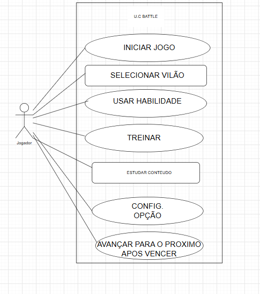

CENTRO UNIVERSITÁRIO DE BRASÍLIA – UNICEUB

**ATIVIDADE ACADÊMICA DE ENGENHARIA DE REQUISITOS**

**Do requisito ao Diagrama de Casos de Uso**

Tema: UML — Diagrama de Casos de Uso

| Alunos: |  |
| :---- | :---- |
| Cauã Diniz | Lucca Peres |
| Moisés Cunha | Eduardo Victor |
| Isabela Saboia | Luís Eduardo |

----
Disciplina: Engenharia de Requisitos

Brasília – DF

Professora: Kadidja Valéria
---

2026

**1. Identificação da atividade**

Esta atividade tem como base o artigo Um Jogo Acessível para o Ensino de UML e aborda a transformação de requisitos textuais em um Diagrama de Casos de Uso do jogo U.C. Battle.

--- 
 **2. Etapa 1 — Leitura e identificação**

Objetivo principal: ensinar conceitos de UML e casos de uso de forma acessível e interativa.

Ator principal: Jogador.

Principais funcionalidades: selecionar fase, enfrentar vilão, responder charada, receber dica, acessar modo de treinamento, estudar conceitos, consultar conteúdo e configurar recursos de acessibilidade.

Regra da dica: pode ser utilizada somente uma vez por batalha e quando o jogador possuir dois pontos de vida ou menos.

---

**3. Quadro de análise**

| Elemento identificado | Classificação |
| :---- | :---- |
| Jogador | Ator |
| Selecionar fase | Requisito funcional |
| Enfrentar vilão | Requisito funcional |
| Responder charada | Requisito funcional |
| Receber dica | Requisito funcional |
| Acessar modo de treinamento | Requisito funcional |
| Estudar conceitos | Requisito funcional |
| Consultar conteúdo | Requisito funcional |
| Configurar acessibilidade | Requisito de acessibilidade |
| Dica uma vez por batalha | Regra de negócio |
| Dica com 2 vidas ou menos | Regra de negócio |

---

**4. Casos de uso do sistema**

1. Selecionar fase

2. Enfrentar vilão

3. Responder charada

4. Receber dica

5. Acessar modo de treinamento

6. Estudar conceitos

7. Consultar conteúdo

8. Configurar recursos de acessibilidade

---

**5. Relações UML**

\<\<include\>\>: Enfrentar vilão → Responder charada. Responder à charada faz parte da batalha.

\<\<extend\>\>: Receber dica → Enfrentar vilão. A dica é opcional e depende das condições estabelecidas para o jogador.

A fronteira do sistema é U.C. Battle e o ator principal é o Jogador.

---
**6. Representação textual do diagrama**

**U.C. BATTLE**

Jogador → Selecionar fase  
Jogador → Enfrentar vilão  
Enfrentar vilão \<\<include\>\> Responder charada  
Receber dica \<\<extend\>\> Enfrentar vilão  
Jogador → Acessar modo de treinamento  
Jogador → Estudar conceitos  
Jogador → Consultar conteúdo  
Jogador → Configurar recursos de acessibilidade

---
**7. Matriz de rastreabilidade**

| ID | Requisito funcional | Caso de uso | No diagrama? |
| :---: | :---- | :---- | ----- |
| RF01 | Selecionar uma fase | Selecionar fase | Sim |
| RF02 | Enfrentar um vilão | Enfrentar vilão | Sim |
| RF03 | Responder perguntas | Responder charada | Sim |
| RF04 | Utilizar uma dica | Receber dica | Sim |
| RF05 | Acessar treinamento | Acessar modo de treinamento | Sim |

---
**8. Checklist de validação**

☑ Ator: Jogador.

☑ Casos de uso escritos com verbos no infinitivo.

☑ Fronteira do sistema identificada como U.C. Battle.

☑ Associações representam interações do jogador.

☑ Relação \<\> utilizada.

☑ Relação \<\> utilizada.

☑ Regra de negócio da dica considerada.

☑ Requisito de acessibilidade considerado.

☑ Requisitos selecionados rastreados no diagrama.

☑ Modelo deve permanecer legível e sem elementos desconectados.

---
**9. Justificativa das decisões de modelagem**

O diagrama representa o jogador interagindo com as principais funcionalidades do U.C. Battle. A relação \<\> foi utilizada entre “Enfrentar vilão” e “Responder charada”, pois responder à charada faz parte da batalha. A relação \<\> foi utilizada para “Receber dica”, pois essa funcionalidade é opcional e depende das condições estabelecidas pelo jogo. A acessibilidade também foi considerada no modelo.

---
**10. Questão de encerramento**

Quando um requisito funcional não possui correspondência clara no modelo UML, podem surgir erros, funcionalidades esquecidas e dificuldades para verificar se o sistema atende aos requisitos.

Fonte principal: Tavares, Irvin Ken Xavier; Eliseo, Maria Amelia. Um Jogo Acessível para o Ensino de UML.

---
**11. Diagrama**

  

